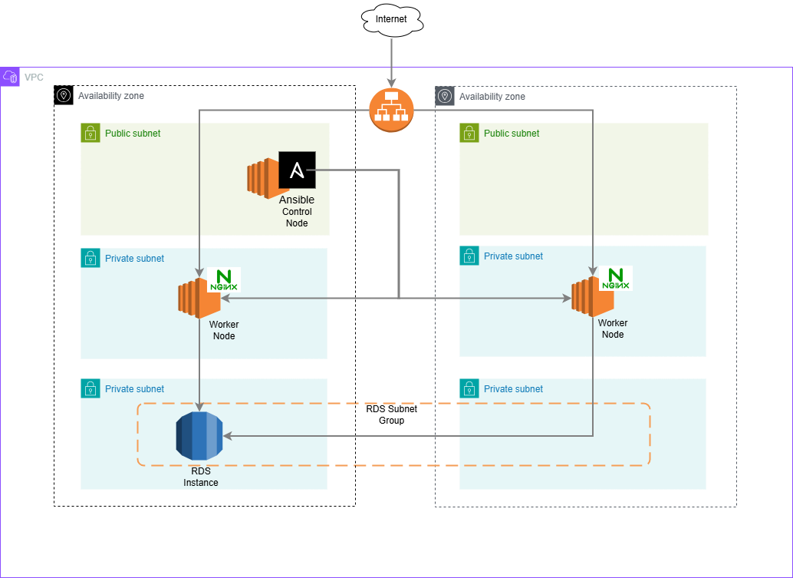

## Overview
This repository contains Ansible playbooks for deploying AWS infrastructure, including EC2 Control and Worker nodes, and an RDS database. It also includes playbooks for configuring the EC2 Control node, establishing connectivity between nodes, and installing a web server on the Worker nodes with firewall configuration and a simple static web page hosted under the web server.

## Repository Structure
The repository contains the following:
- Root level - Includes the Ansible configuration file and several YAML files representing different Ansible playbooks, which will be described in detail later. It also contains a YAML file listing the requirements for the Ansible configurations.
- `roles/` - This folder contains the Ansible roles used by the playbooks at the root level.
- `vars/` - Contains variables for the Ansible roles and playbooks.
    - `vars/aws.yaml` - Stores the AWS related variables
    - `vars/global.yaml` - Stores some general variables
    - `vars/vault.yaml` - Stores the password of the RDS Instance in Ansible Vault (you need to specify the Vault password during the playbook execution)
- `docs` - A folder with images used in the README (can be ignored).

## Architecture Diagram


## Deployment Steps

**AWS Infrastructure**: The `create-infrastructure` Ansible playbook handles the creation of all AWS resources. It requires an existing EC2 key pair, which should be specified in the `vars/aws.yaml` file under the `ec2.key_name` attribute. This playbooks depends on the following Ansible roles:

- `vpc` - Creates all networking settings in AWS, including the VPC, public and private subnets, Internet Gateway, NAT Gateway, route tables, and security groups. These configurations follow best practices by isolating critical resources in private subnets and restricting access to specific security groups and ports.

- `control-node` - Creates an EC2 instance in a public subnet to serve as the Ansible Control node. It has a security group which allows access only from specific CIDR ranges set in the `vars/global.yaml` under the `network_cidr` attribute (recommendations - your personal IP or VPN cidr or some specific private network cidr).

- `worker-node` - Creates two EC2 instances in a private subnet to serve as Ansible Worker nodes. The instances are assigned a security group that allows access from the Ansible Control node's security group on port 22 and from the ALB's security group on port 80. (This is a playground setup, so HTTPS communication is not configured.)

- `database` - Creates an RDS instance in a separate private subnet. The instance is assigned a security group that allows access only from the Worker nodes on port 3306, as it uses MySQL.

- `alb` - Creates an Application Load Balancer and a Target Group that registers the Worker nodes with the load balancer. The load balancer is assigned a security group that allows traffic on port 80 from anywhere worldwide. (This is a playground setup, so HTTPS communication is not configured.)

**Control Node setup**: The setup of the Control node is handled by the `control-node-setup` Ansible Playbook. It relies on the `control-node-setup` role which installs Python, Git and Ansible.

**Control and Worker nodes connectivity**: This is handled by the `nodes-ssh-connection` Ansible Playbook. It includes a task to copy the EC2 PEM key to the Control node and uses the `hosts-connectivity` role to set up connectivity between the Control and Worker nodes. The role generates an SSH key on the control node and adds it to the authorized keys of the Worker nodes, ensuring secure communication between the nodes.

**Nginx configuration and static page deployment**: This is handled by the `nginx-static-page` Ansible Playbook where it call the `nginx` Ansible role. The role installs Nginx and FirewallD to enable HTTP communication, creates a folder for the static pages, and configures the Nginx web server to serve the content properly.

## Deployments steps with commands

### Execute these steps from a local environment

1. AWS Infrastructure

    ```
    ansible-playbook create-infrastructure.yaml --ask-vault-pass
    ```

2. Fill in the following details in the `inventory` file
    - <control_node_ip> - IP of the Contorl Node
    - <pem_key_path> - download the EC2 Key from AWS and set the path to this variable
    - <worker1_ip> and <worker2_ip> - IPs of the Worker Nodes

3. Control Node setup

    ```
    ansible-playbook control-node-setup.yaml
    ```

4. Control and Worker nodes connectivity

    ```
    ansible-playbook nodes-ssh-connection.yaml
    ```

5. SSH into the control node. From this point onward, the worker nodes can be managed directly from the control node.

### Execute these steps from the Control Node

6. Nginx configuration and static page deployment

    ```
    ansible-playbook nginx-static-page.yaml
    ```